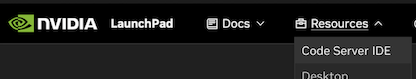
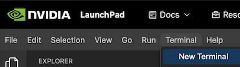
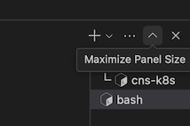
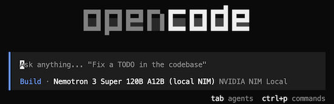

# Participant Guide: OpenCode with Local Nemotron 3 Super

Welcome. In this lab, you will use OpenCode inside the LaunchPad **VS Code Environment**. Staff have already deployed a local NVIDIA Nemotron 3 Super NIM model on the machine.

You do not need to install Docker, configure GPUs, or provide an NGC key.

## 1. Open the VS Code Environment

Staff will provide the LaunchPad URL for your lab environment. It will look like this:

```text
https://<uuid>.nvidialaunchpad.com/launch
```

1. Open the LaunchPad URL in your browser.
2. On the login page, sign in or sign up with your email address for an NVIDIA account.
3. After you enter the LaunchPad environment, open the **Resources** menu and select **Code Server IDE**.



4. In VS Code, create a new Bash terminal by going to **Terminal > New Terminal**.



You can maximize the terminal by clicking the up arrow icon on the right side of the terminal panel.



## 2. Check the Local Model

```bash
curl -fsS http://127.0.0.1:8000/v1/health/ready
curl -s http://127.0.0.1:8000/v1/models | jq .
```

Expected model:

```text
nvidia/nemotron-3-super-120b-a12b
```

## 3. Start OpenCode

Go to the lab project directory:

```bash
cd ~/opencode-lab
```

Start OpenCode:

```bash
opencode
```

OpenCode should default to **Nemotron 3 Super 120B A12B (local NIM)** as shown:



If it does not, you can select the model inside OpenCode:

```text
/models
```

Select:

```text
NVIDIA NIM Local / Nemotron 3 Super 120B A12B (local NIM)
```

## 4. First Prompt

Try:

```text
Create a simple Hello World program in Python. Keep your response short: tell me the file you created and how to run it.
```

Use `Tab` to switch between Plan and Build modes.

## 5. Quick Troubleshooting

If OpenCode does not respond, ask staff to check that the NIM container is running:

```bash
docker ps --filter name=nemotron3-super-nim
```

If you see an error about `tool_choice` or tool calls, ask staff to restart NIM with tool calling enabled.

If OpenCode shows internal thinking text such as `</think>`, ask staff to refresh the OpenCode local NIM config.

We will refine this participant guide before the lab.
