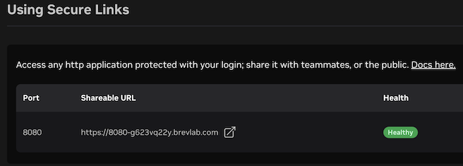
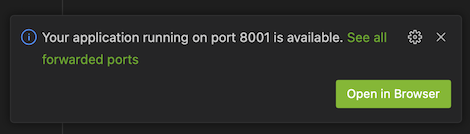
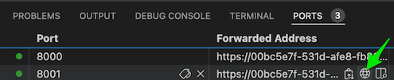

# Brev Launchable: VS Code Server + OpenCode

[Launch this Brev environment](https://brev.nvidia.com/launchable/deploy/now?launchableID=env-3ETZ0C9mesCKRPbfqAAdijzrV8S)

This is a NVIDIA Brev Launchable for a browser-based VS Code Server development environment with OpenCode installed.

OpenCode is an AI coding agent that runs in the terminal. It can inspect a repository, edit files, run commands, and help users build, debug, and iterate on code from inside the workspace.

This Launchable defaults OpenCode to **Nemotron 3 Super Free** through OpenCode Zen. You do not need to install Docker, configure GPUs, run a local model server, or provide an API key for the default experience.

VS Code Server runs through code-server and is available through a Brev Secure Link on port `8080` by default. No code-server password is required by default; the Brev environment link opens directly into the workspace.

The default editor theme is dark, and the Chat panel on the right is hidden on startup.

## Brev Environment

This Launchable provides:

- VS Code Server in the browser
- OpenCode installed for the VM user
- OpenCode available from the integrated terminal
- Nemotron 3 Super Free selected by default through OpenCode Zen
- A prepared repository workspace for the lab
- Secure Link on port `8080` for VS Code Server
- Optional Secure Link app ports, such as `8001`, for testing web apps

## 1. Open VS Code Server

Open the Brev instance page, then go to the **Access** tab on the right side of the page. Scroll down to the **Using Secure Links** section.



There will be a Secure Link for port `8080`. Open that link to access VS Code Server.

When VS Code Server opens, you may see a prompt asking whether you trust the authors of the files in the folder. For this lab, click **Yes, I trust the authors** so VS Code Server enables all workspace features.

In VS Code Server, create a new Bash terminal by clicking the menu icon with three lines in the top-left corner, then selecting **Terminal > New Terminal**.

You can maximize the terminal by clicking the fullscreen-style icon on the right side of the terminal panel.

## 2. Start OpenCode

Start OpenCode from the integrated terminal:

```bash
opencode
```

OpenCode should default to:

```text
Nemotron 3 Super Free
```

If it does not, open the model picker:

```text
/models
```

Select:

```text
OpenCode Zen / Nemotron 3 Super Free
```

## 3. First Prompt

Try:

```text
Create a simple Hello World program in Python. Keep your response short: tell me the file you created and how to run it with python3.
```

## 4. Planning Mode

For the next prompt, press `Tab` to switch into **Plan** mode. Plan mode is indicated by the orange line and orange text.

Paste this prompt:

```text
I want to build a simple, fun web-based To-Do list app with neon colors. It should let me add tasks, delete them, and play a 'ding' sound when I complete one.
```

In Planning mode, OpenCode may ask follow-up questions like the app scope, storage behavior, sound effect, or whether to proceed. Use the arrow keys to choose an option and press `Enter` to confirm. If offered, you can also type your own answer.

## 5. Test the App

Press `Tab` to switch back into **Build** mode.

Paste this prompt:

```text
Run the app on port 8001.
```

OpenCode will run the server so you can test it in the browser.

You may see a notification in the bottom-right corner of VS Code that your app is running on port `8001`. Click the green **Open in Browser** button.



If you missed the notification, open the **Ports** tab next to the **Terminal** tab. Look for the line for port `8001`. Under **Forwarded Addresses**, hover over the address and click the globe icon to open the app in your browser.



You can also create another terminal and run the Python server yourself:

```bash
python3 -m http.server 8001
```

## 6. Keep Experimenting

Now try modifying the app. Stay in **Build** mode and ask OpenCode for small changes, then run the app again.

Example prompts:

```text
Change the background to a neon sunset gradient.
```

```text
Make the font bigger and easier to read.
```

```text
Add a fun animation when I complete a task.
```

If you test the UI in a browser, style changes may be cached. If your latest changes do not show up, ask OpenCode to include a cache buster.

```text
Add a cache buster so the browser loads the latest CSS and JavaScript.
```

## 7. Advanced Exercise

If you finish early, turn the To-Do list into a more complete app. Try these prompts one at a time, testing after each change:

```text
Add localStorage so tasks stay saved after I refresh the page.
```

```text
Add filters for All, Active, and Completed tasks.
```

```text
Add an edit button so I can rename a task.
```

```text
Add keyboard support: Enter adds a task and Escape cancels editing.
```

```text
Make the app responsive and polished on mobile.
```

Ask OpenCode to review before making the next change:

```text
Review the code and suggest three improvements before changing anything.
```

Then ask OpenCode to explain what it built:

```text
Explain the main files in this app and how the UI state works. Keep it beginner friendly.
```

When you are done, quit OpenCode with:

```text
/exit
```

## Optional: Connect NVIDIA

The default OpenCode Zen setup does not require an API key.

If you have an NVIDIA API key and want to use NVIDIA-hosted models directly, connect NVIDIA from inside OpenCode:

```text
/connect
```

Search for:

```text
NVIDIA
```

Select the NVIDIA provider and paste your NVIDIA API key when prompted. After connecting, use `/models` to choose the NVIDIA model you want to use.

## Quick Troubleshooting

If `opencode` is not found, reload the shell or source the Bash profile:

```bash
source ~/.bashrc
opencode --version
```

If OpenCode cannot create files under your home directory, fix ownership of the user-local directories:

```bash
for path in "$HOME/.local" "$HOME/.config" "$HOME/.cache" "$HOME/.opencode"; do
  [ -e "$path" ] && sudo chown -R "$USER:$(id -gn)" "$path"
done
```

If a web app does not open, confirm the app is running on a configured Secure Link port such as `8001`, then check the VS Code **Ports** tab.
